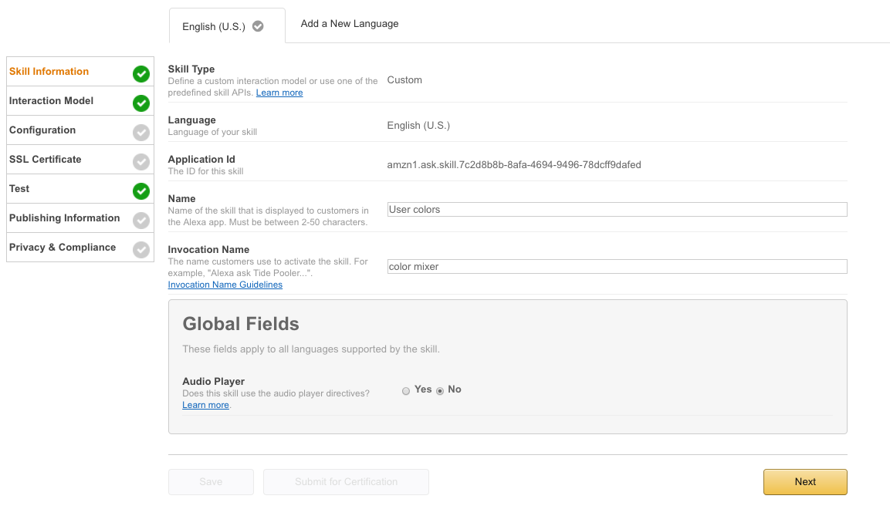
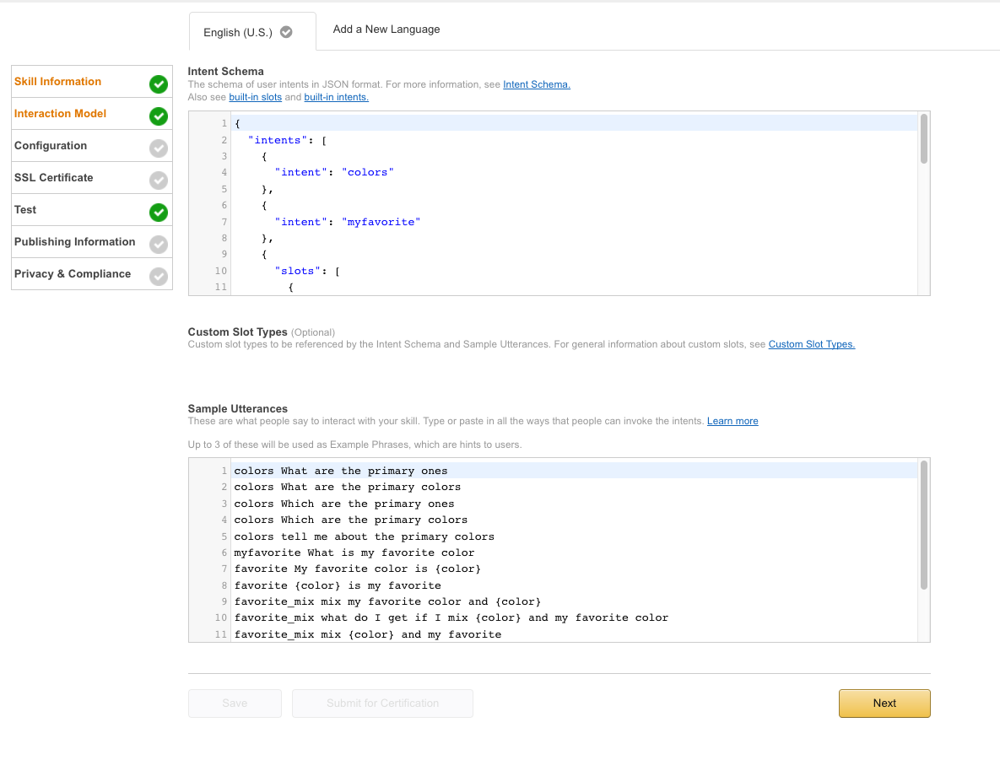
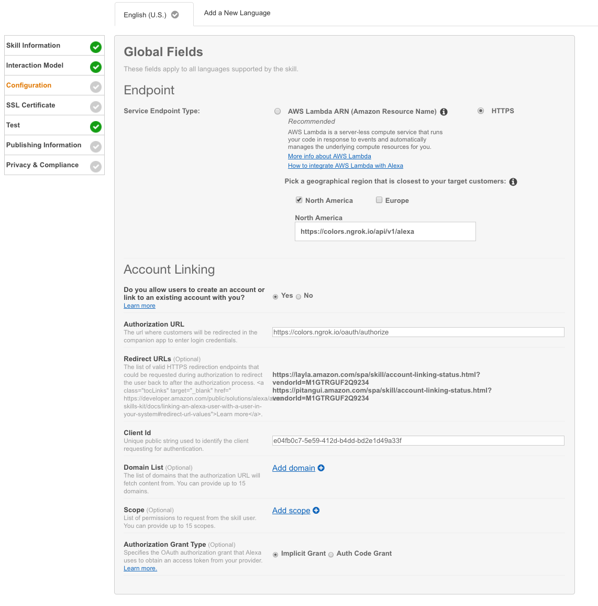
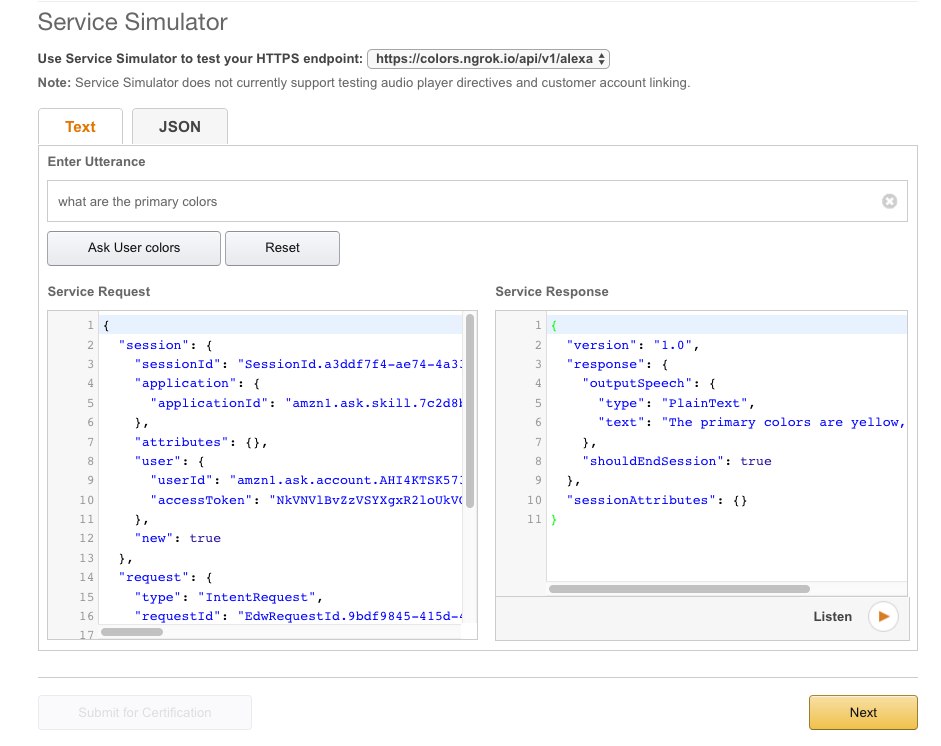
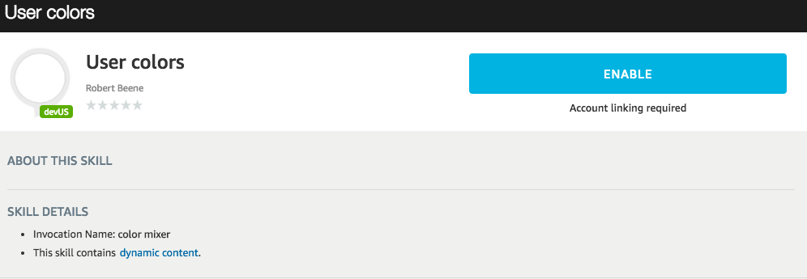

# Alexa Demo - Primary Colors

#### Setup Steps

```
mix deps.get
mix ecto.create
mix ecto.migrate -r Authable.Repo #add tables for user linking
mix ecto.migrate
mix run priv/repo/seeds.exs # seed data with one user and one client (Alexa)
```

#### Amazon Setup

* create Amazon Developer Account - [Signup](https://developer.amazon.com/)

* create new Alexa skill

[](https://developer.amazon.com/edw/home.html#)

* Add skill info. For our primary colors skill, we will not be using Audio Player directives. 



* Interaction Model
	* add intents using the intent.json file
	* add utterances using the utterances.json file 



* Configure Your Skill 
	* Select HTTPS as the service endpoint type
	* Provide valid URL for endpoint to your local machine (I suggest using [ngrok](https://ngrok.com))
	* Supply client ID based on the client from the seed data. You can retrieve this with the following query in iex 
	* Specify implicit grant for Authorization Grant Type

```
AlexaDemo.Repo.get_by(Authable.Model.Client, name: "demo").id
```



* Do not select an SSL certificate option

#### Testing

At this point, you should be able to test the skill using the web interface.



With that successful test, you can move on to testing with your Alexa device. First you'll need to link accounts.

* Visit [Your Skills](http://alexa.amazon.com/spa/index.html#skills/your-skills/?ref-suffix=ysa_gw) and locate your application
* Select the skill and disable it if it's currently enabled.
* Select Enable



* when prompted to login, use the following credentials
	* username: test@test.com
	* password: test1234

Now you should be able to test the following interactions:

* Alexa - launch color mixer. 

This is an example of an intent where the session is left open. If you respond quickly, you can simply say "what are the primary colors" without using the invocation name or "Alexa". This is indicated by the blue ring remaining on around the device. 

* Alexa - ask color mixer what are the primary colors. 
* Alexa - tell color mixer my favorite color is red.
* Alexa - ask color mixer what do I get when I mix blue and red?
* Alexa - tell color mixer my favorite color is blue.
* Alexa - ask color mixer what do I get when I mix my favorite color and red?
* Alexa - ask color mixer what is my favorite color?

Although basic in nature, this skill demonstrates key pieces to voice integrations. Intents, slot values, and user linking combine to open the endless possibilities. 